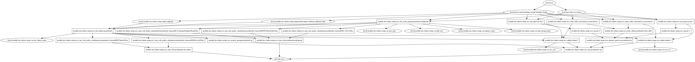

## Deploy EKS using Terraform

> This project helps user to setup EKS in a automated way. Following are the features:

 - EKS Cluster setup using `Terraform` scripts (Supported)
 - Here is the terraform graph
   
